# LifeOS 🌌

**The operating system for your life.** Finance, health, food, habits, goals,
mood and an AI life coach — unified by a single event-based core.

> "You are not using an app — you are using a system that manages your life."

A cross-platform Flutter app that runs **fully offline, plugin-free** (builds for
Windows desktop, Web and Android from the same code, no Developer Mode needed).

---

## 📱 How it looks

Every shot below is the real app, rendered from this commit — same widgets, same
copy, same colours. Both skins ship: **paper** (a warm cream page with ink type)
and **night**.

### Home — a magazine front page

One room can run a lead story: a full-bleed cover in its own colour with the
headline and a single thing to do about it, over three quiet spines. Reading
order never rearranges; only the lead is lifted out of it.

When nothing needs you, **nothing leads** — the Life Score takes the top and all
four rooms stay spines. That empty headline is the point, not a gap.

| Lead story | A calm day |
|---|---|
| 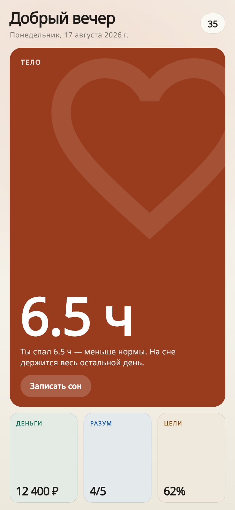 | 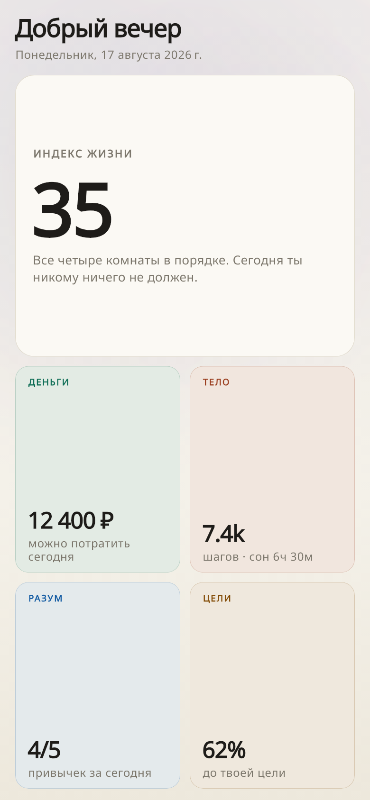 |
| 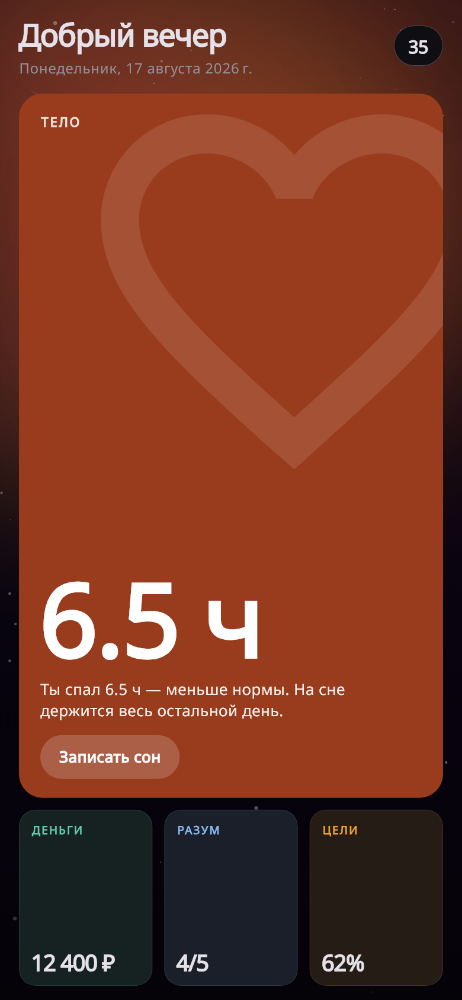 | 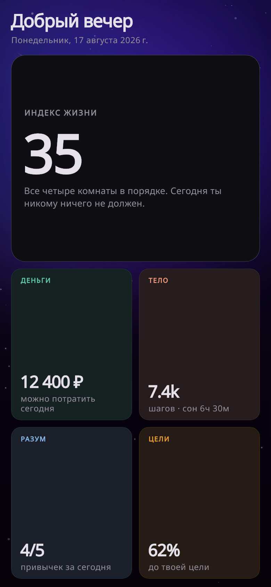 |

### The four rooms

| Money | Body |
|---|---|
| 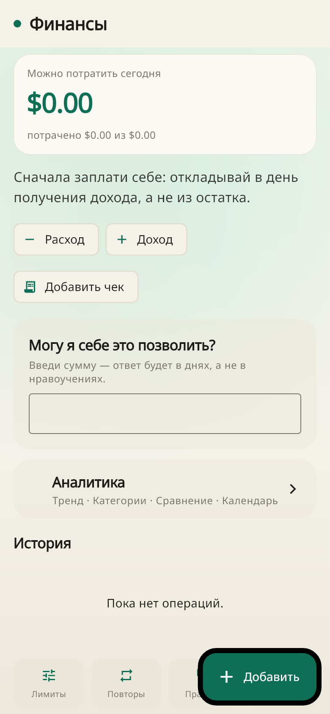 | 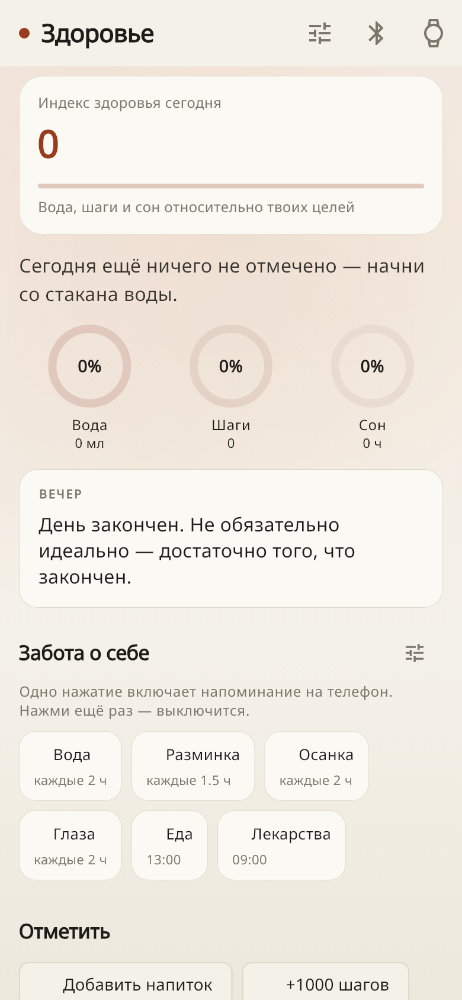 |
| 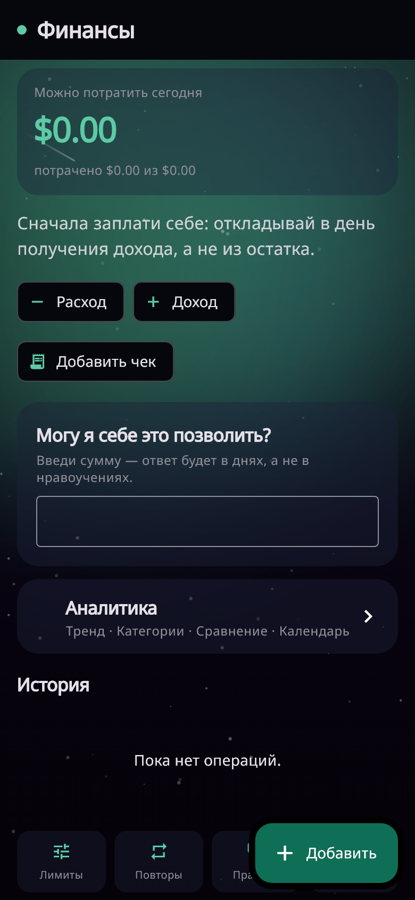 | 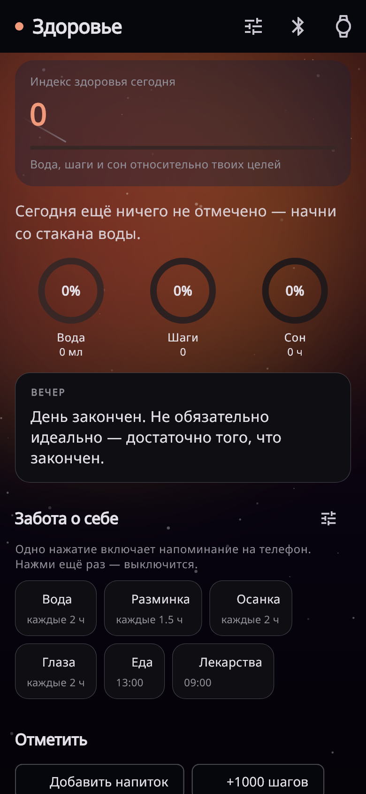 |

| Mind | Goals |
|---|---|
| 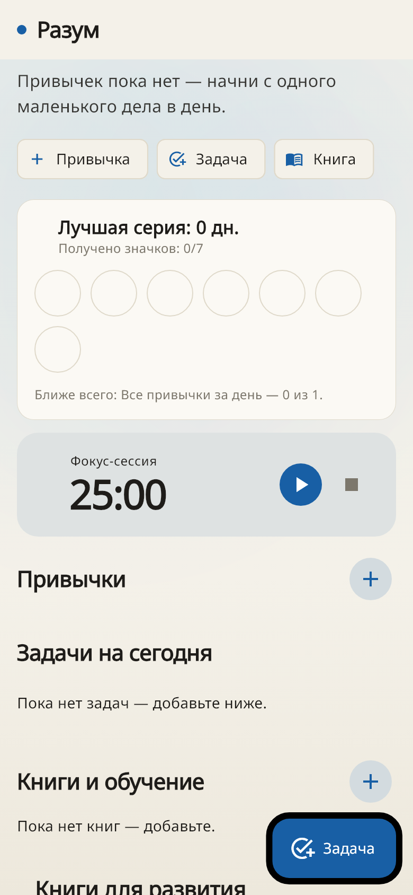 | 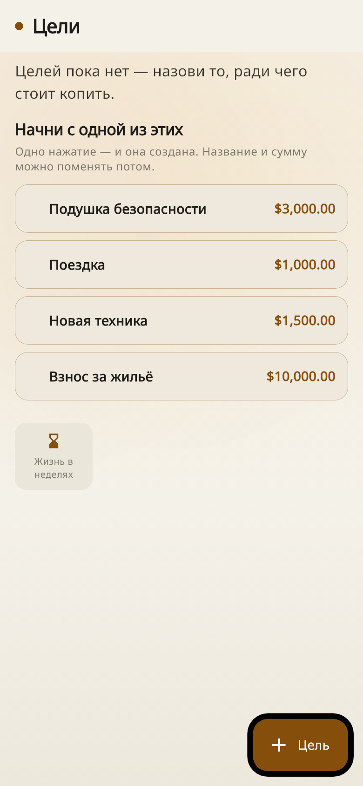 |
| 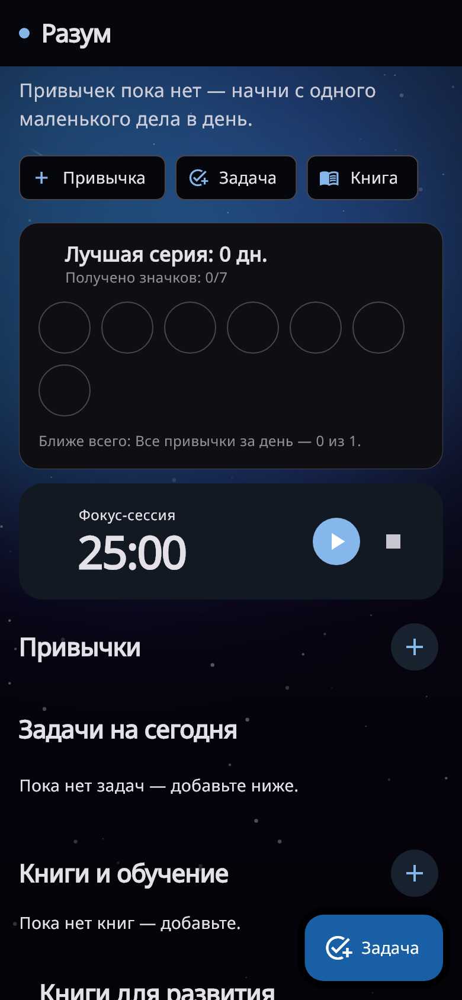 | 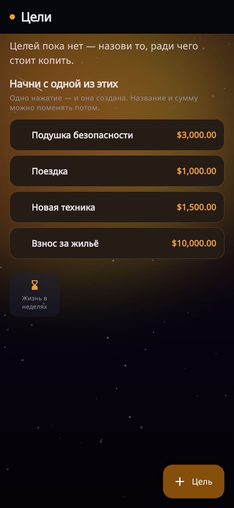 |

- **Money** answers the one question the rest of the app cannot: *can I afford
  this?* — in days of your remaining allowance, not in a percentage or a lecture.
- **Body** carries the day's line (a different sentence for morning, midday and
  evening, and a different one tomorrow) and one-tap care reminders that fire as
  real phone notifications.
- **Mind** holds habits, tasks, books and a focus timer, with the nearest
  unearned badge named so an empty wall is a target rather than a tally.
- **Goals** offers four goals to start from; only the safety cushion is worked
  out from real spending, and only that one says so.

### Day, plan, and the long view

| Today | Planner | Telescope |
|---|---|---|
| 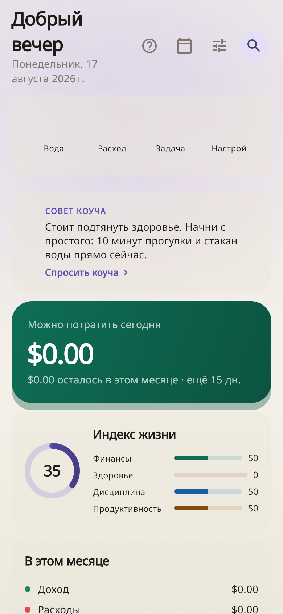 | 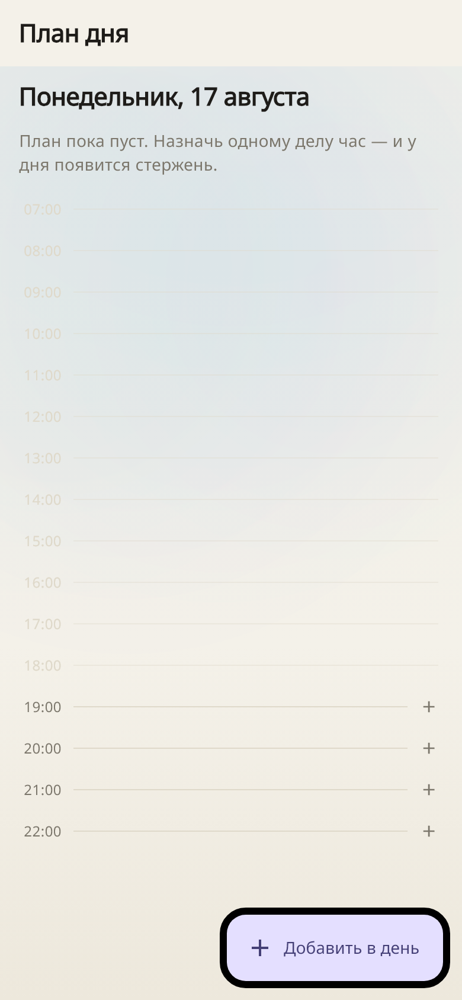 | 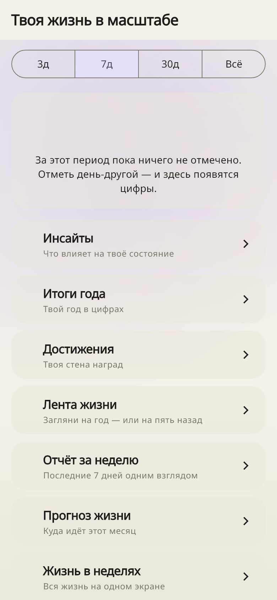 |

The planner draws its hours whether or not anything is in them — the shape of the
day is the point. A free hour is tappable and opens already pointing at that
slot; an hour already gone is drawn fainter and is not, because planning the past
is not something to invite anyone to do.

---

## ✨ Highlights

**Core pillars**
- **MoneyOS** — income/expenses, categories, live balance, automatic 10–20%
  reserve, budgets, spending analytics, receipt parser, CSV import/export,
  recurring transactions, category limits.
- **HealthOS** — water/steps/sleep/weight/stress/vitals with goal rings, weekly
  charts, body measurements, workouts (live wger catalog) + a training guide.
- **FoodOS + Dietitian** — pantry & expiry, shopping list, meal planner, a
  calorie/macro dietitian with a manual food log and live UA store prices.
- **MindOS** — habits (streaks + heatmap), tasks, a Pomodoro timer, books, and a
  mood journal.
- **GoalsOS** — long-term goals with milestones and a savings-based forecast.
- **Wellness** — a Flo-style cycle tracker (women) / vitality tracker (men).

**Intelligence & delight**
- **Today** — a customizable home screen (show/hide + drag-reorder every card),
  the four-pillar **Life Score**, a proactive **AI coach tip**, quick actions,
  habit/task check-off, and teasers.
- **AI Coach** — a rule-based chat that answers from your real data (finances,
  sleep, steps, water, habits, goals, mood, patterns).
- **Insights** — honest cross-pillar correlations (mood vs sleep/steps/water/
  spending/stress), mood patterns (happiest weekday, trend, activity impact).
- **Achievements** — a 16-badge trophy wall with unlock notifications.
- **LifeOS Wrapped** — a shareable, Spotify-Wrapped-style year recap (any year),
  plus shareable Insights and weekly-report cards.
- **Long-term history** — a monthly archive so you can look back a year (or five).
- Reminders (real phone notifications), a notification center, a command palette
  (global fuzzy search + quick actions), theme personalization (6 cosmos accents
  + light/dark), i18n in **EN / RU / UK**, offline backup & restore, PIN app-lock,
  cosmos branding (launcher icon, onboarding, splash, glassmorphism).

---

## 🚀 Getting started

CI pins **Flutter 3.35.5 (stable)** and runs analyze, tests and the web/Android
builds on every push and pull request (SDK constraint `>=3.4.0 <4.0.0`). Day-to-
day development and the screenshots above are on **3.44.4 stable**, so the pin is
the floor rather than the only version that works.

```bash
flutter pub get
flutter analyze     # → No issues found
flutter test        # → 560 tests passing
flutter run -d chrome        # or -d windows / an Android device
```

**Build:**

```bash
flutter build web --release      # build/web
flutter build apk --release      # Android
flutter build windows --release  # Windows host only (needs VS C++ toolchain)
```

Status: `flutter analyze` clean · **560 tests passing** · Web, Android APK, an
Android app bundle and Windows desktop all build.

Several of those tests exist because a screenshot caught something the suite
could not, and each one closes that whole class rather than the single bug:
contrast on both skins, no retired colour literals anywhere in the source, no
mis-decoded text, no raw localization key reaching the screen, one voice in the
Russian copy, and every screen laid out at 360px and at 1.5× system text.

> **Windows note:** the Dart analyzer LSP crashes on non-ASCII project paths, so
> on a machine whose path contains non-ASCII characters, run tooling from an
> ASCII junction/copy (e.g. `C:\src\lifeos`). Not an issue on macOS/Linux.

See [`CLAUDE.md`](CLAUDE.md) for conventions and constraints before contributing.

#### Web behind a restricted network / fully offline

By default Flutter web (CanvasKit) fetches its rendering engine — and the
default text font — from Google's CDN at runtime. To vendor CanvasKit into the
bundle so the build never depends on that CDN:

```powershell
flutter build web --release --no-web-resources-cdn
```

Fonts are fully bundled too: a web-only stack (Roboto + Noto Sans for ₴ and
other glyphs + a Noto color-emoji subset + a DejaVu symbols fallback) so text,
currency and emoji all render with **zero network** — verified with every
`*.gstatic.com`/`*.googleapis.com` request blocked. A CI check
(`tool/check_font_coverage.py`) fails the build if any UI string uses a glyph no
bundled font carries. Mobile keeps its native system fonts.

### Developing from Claude Code on the web / mobile

`.claude/hooks/session-start.sh` (a `SessionStart` hook) installs Flutter and
runs `flutter pub get` automatically when a Claude Code web session starts, so
the project is ready to analyze, test and build without any manual setup — you
can keep working on it from a phone.

---

## 🏗️ Architecture

Strict Clean Architecture — **the UI never contains business logic**; it emits
events and observes repositories.

```
Presentation (Flutter widgets · Riverpod providers, no codegen)
      │  emits events / watches state
Application (UseCases: AddTransaction, ComputeBudget, …)
      │
Domain (pure Dart entities: Transaction, Budget, Money — no Flutter)
      │
Data (repository impls; local-first, Firebase-ready behind interfaces)
      │
Core (EventBus · LifeCoreEngine · services · Life Score)
```

Every action becomes a `LifeEvent` → `EventBus` → `LifeCoreEngine` → handlers
(event log, notifications, AI). See [`docs/ARCHITECTURE.md`](docs/ARCHITECTURE.md).

### Key design choices

- **Plugin-free.** Platform features (notifications, OCR, file save, URL open,
  storage, image share) sit behind conditional-export seams with no-op fallbacks,
  so the Windows build stays plugin-free.
- **Local-first.** Persistence is a `KeyValueStore` seam (JSON file on desktop,
  `localStorage` on web) behind repository interfaces; a REST Firebase sync layer
  exists for optional cloud backup (see `docs/FIREBASE.md`).
- **Money as integer minor units** — exact arithmetic, never `double`.
- **Custom i18n** (EN/RU/UK) — one string table, completeness enforced by a test.

```
lib/
  core/        constants · events (LifeEvent/EventBus) · engine · services · i18n · utils
  features/    money · health · food · mind · goals · wellness · home(Today) · ai ·
               coach · insights · achievements · wrapped · history · reminders ·
               notifications · reports · backup · security · appearance · search ·
               onboarding · profile · lifeweeks   (each: domain/application/data/presentation)
  shared/      models(money) · providers(core_providers) · theme · widgets
  app.dart · main.dart
```

---

## 🔌 Optional integrations (need your own accounts)

- **Firebase** cloud sync — plugin-free REST layer is built; provide a project
  (`docs/FIREBASE.md`).
- **Real device health data** — port + mock in place; add the `health` package on
  a phone (`docs/DEVICES.md`).
- **Grocery prices** — a curated, fully offline catalog of brand-free
  approximate prices (no retailer is contacted).

---

## 🧪 Quality bar

- `flutter analyze` clean and `flutter test` green are the definition of done.
- `analysis_options.yaml` promotes `dead_code` / `unawaited_futures` to errors.
- Pure use cases and engines are unit-tested without any I/O; there's a full-app
  boot smoke test and widget tests for the key screens.

---

## 📄 License

Source code is released under the [MIT License](LICENSE) — © 2026 barbadalov.

Bundled fonts keep their own licenses (Roboto — Apache-2.0; Noto Sans / Noto
Color Emoji — SIL OFL-1.1; DejaVu symbols — Bitstream Vera); full texts ship in
[`assets/licenses/`](assets/licenses/) and are listed in-app under **More →
Open source licenses**. Privacy policy: [`docs/PRIVACY.md`](docs/PRIVACY.md).
